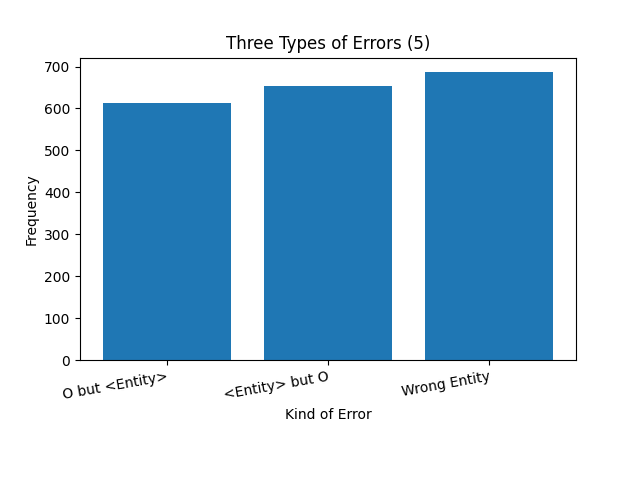
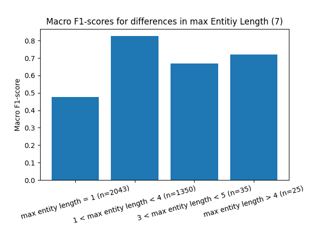

## Building
```
docker build . -t python_test_sa
```

## Running
```
docker run -it -v "$PWD":/workspace/ --gpus all python_test_sa bash
```

## Evaluation
### Micro- and Macro-averaged F1-Scores
In the course of the training it can be seen that the macro F1-score increases from approx. 0.79 to 0.85 and the micro F1-score from approx. 0.95 to 0.97. The final micro F1-score is 0.96 and the macro F1-score 0.8 on the test set (1). This difference is expected since classes of different sizes exist (2). The micro F1-score weights larger classes more heavily and thus increases quickly when the performance of large classes increases [[1]](./paper/dl_ner_survey.pdf). The macro F1-score should be preferred here because it weights the individual classes equally .

<p float="left">
  
   
</p>

The training logs can be found [here](./training_log.txt).


### Where does the model fail?
To find out where the model fails, an analysis of several conceivable errors was first performed. The model is then examined for weaknesses on several buckets of the test set [[2]](./paper/ner_evaluation.pdf).

The three simplest categories of errors are:

1. The model predicts an entity where there is none
2. The model does not recognize the presence of an entity
3. The model recognizes a wrong entity

In figure 5 it can be observed that the error of category 3 occurs most frequently, followed by 2 and 1. As can be seen in figure 3 and 4, the entity organization (B-ORG and I-ORG) is the most frequently error.
It looks like the performace of the model decreases with increasing sentence length (6) and also it can be seen that there is a performance drop if entities only consist of one token (7). There is a higher Macro F1-score if no OOV token is included in the sentence (8) and the model performs better at a medium entity density (9). Macro F1-score decreases with increasing token-label inconsistency, except for a dip at no inconsistency (10).

<p float="left">
   
  
   
   
   
   
   
   
</p>


### What might cause the errors of the model? 
Error category one, the model recognizes a wrong entity, could be due to a lack of context understanding. Here, for example, a transformer architecture as encoder could help [[1]](./paper/dl_ner_survey.pdf). Lower macro F1-scores in lower entity density and lower max. entity length could imply that the model performse bad on short and few entities in a sentence which also points to a lack of context understanding. 
Error category one, the model does not recognize the presence of an entity, could be related to the fact that corresponding class (O) accounts for more examples in the data than all other classes combined. A weighting of the loss function could help here.  
The use of dropout and another kind of decoder like conditional random fields could also increase the performance [[3]](./paper/lstm_crf.pdf). For the problem of decreasing performance with longer sentences, several sentences could be concatenated in the training data. 


## References
[[1] A Survey on Deep Learning forNamed Entity Recognition](./paper/dl_ner_survey.pdf)

[[2] Enterpretable Multi-dataset Evaluation for Named Entity Recognition](./paper/ner_evaluation.pdf)

[[3] Cloze-driven Pretraining of Self-attention Networks](./paper/lstm_crf.pdf) 
    
